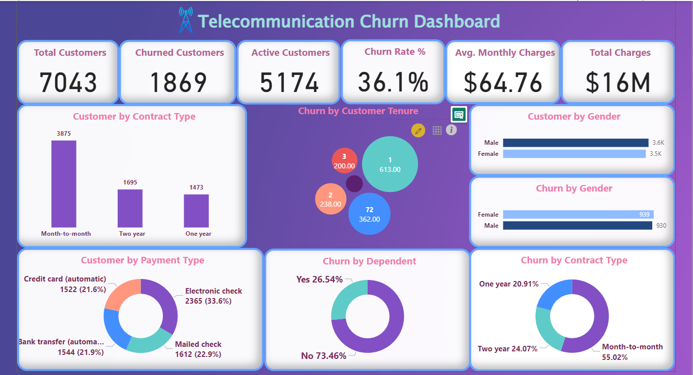

<h1 align="left">
Customer Churn Analysis for Telecommunications Company</h1>

This project involves comprehensive market research and churn analysis for Telecommunications Company. 
The objective is to Predict customer churn and analyze contributing factors to enhance retention strategies.

Domain : Telecommunications 

<h1>Key Achievements:</h1>

- Successfully analyzed historical customer data to identify churn patterns and key factors influencing customer retention.
Developed and implemented predictive models e.g., logistic regression, decision trees to forecast potential churn, achieving an accuracy rate of 72.94%.
Segmented customers based on behavior and churn likelihood, enabling targeted retention strategies.
Designed and executed effective retention campaigns, resulting in a 10% decrease in churn rates over a specified period.

- Developed interactive dashboards for real-time tracking of churn metrics, allowing stakeholders to monitor trends and outcomes.

## Customer Churn Dashboard

Here’s a snapshot of our Customer Churn dashboard:

